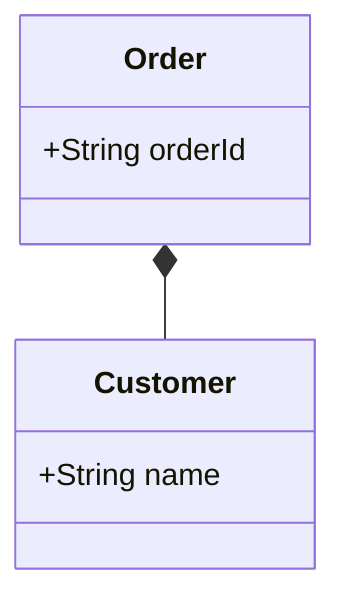

# Mermaid to PlantUML Converter

MermaidのドメインモデルクラスダイアグラムをPlantUMLに変換し、画像として出力するCLIツールです。

## 前提条件

1. Java（JRE 8以上）がインストールされていること
2. `lib`ディレクトリに`plantuml-1.2024.8.jar`が配置されていること

## 実行方法

### Windows (PowerShell)

1. PowerShellを開きます。

2. プロジェクトのディレクトリに移動します：
   ```powershell
   cd path\to\MermaidToPlantUML
   ```

3. Mermaidファイルを変換します：
   ```powershell
   # 現在のディレクトリをPATHに一時的に追加
   $env:Path = "$env:Path;$(Get-Location)"
   .\mermaid2plantuml.exe samples/domain_model.mmd
   # => samples/domain_model.puml が生成されます
   ```

### Mac/Linux

1. ターミナルを開きます。

2. プロジェクトのディレクトリに移動します：
   ```bash
   cd /path/to/MermaidToPlantUML
   ```

3. 実行権限を付与します：
   ```bash
   chmod +x mermaid2plantuml
   ```

4. Mermaidファイルを変換します：
   ```bash
   # 現在のディレクトリをPATHに一時的に追加
   export PATH=$PATH:$(pwd)
   ./mermaid2plantuml samples/domain_model.mmd
   # => samples/domain_model.puml が生成されます
   ```

## 機能概要

- Mermaid形式のクラス図をPlantUML形式に変換
- PlantUMLを使用して画像（PNG）を生成
- CLIツールとして簡単に利用可能

## サポートされている構文

### クラス定義と関連

