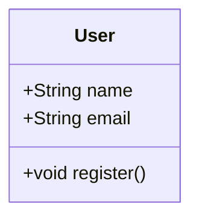
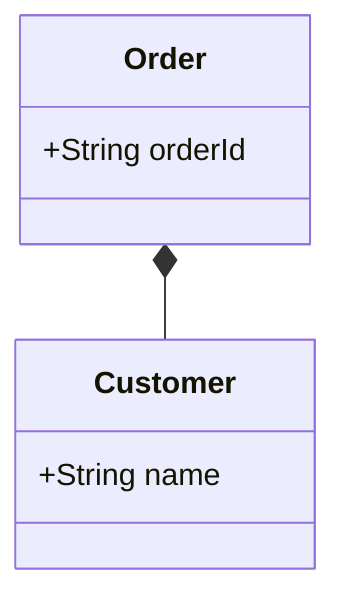
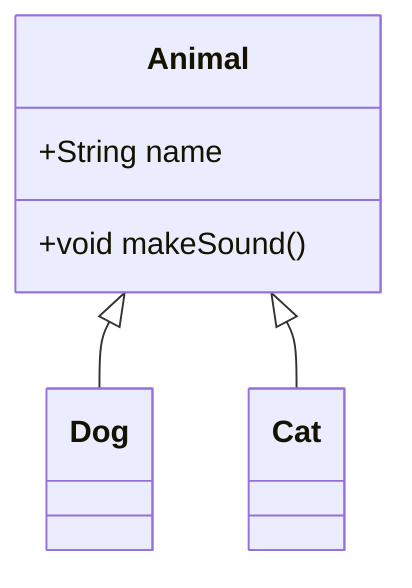

# Mermaid to PlantUML Converter

MermaidのドメインモデルクラスダイアグラムをPlantUMLに変換し、画像として出力するCLIツールです。

## 前提条件

1. Java（JRE 8以上）がインストールされていること
2. `lib`ディレクトリに`plantuml-1.2024.8.jar`が配置されていること

## 実行方法

### Windows

1. PowerShellを開きます

2. プロジェクトのディレクトリに移動：
   ```powershell
   cd D:\path\to\MermaidToPlantUML
   ```

3. 現在のディレクトリをPATHに追加し、Mermaidファイルを変換：
   ```powershell
   # 現在のディレクトリをPATHに一時的に追加
   $env:Path = "$env:Path;$(Get-Location)"
   
   # Mermaidファイルを変換
   .\mermaid2plantuml.exe .\samples\domain_model.mmd > output.puml
   ```

変換が成功すると、以下のファイルが生成されます：
- PlantUMLファイル（output.puml）
- 画像ファイル（output.png）

注意：PATHの設定は現在のPowerShellセッションでのみ有効です。新しいウィンドウを開くと再度設定が必要です。

### Mac/Linux

1. ターミナルを開きます

2. プロジェクトのディレクトリに移動：
   ```bash
   cd /path/to/MermaidToPlantUML
   ```

3. 実行権限を付与：
   ```bash
   chmod +x mermaid2plantuml
   ```

4. Mermaidファイルを変換：
   ```bash
   ./mermaid2plantuml ./samples/domain_model.mmd
   ```

## 機能概要

- Mermaid形式のクラス図をPlantUML形式に変換
- PlantUMLを使用して画像（PNG/SVG/PDF）を生成
- CLIツールとして簡単に利用可能

## インストール手順

### 1. 前提条件

#### Go環境のセットアップ
1. [Go公式サイト](https://golang.org/dl/)から、Go 1.16以上をダウンロード
2. インストーラーを実行し、指示に従ってインストール
3. インストールの確認:
```bash
go version
```

#### PlantUMLのセットアップ（Windows環境）

1. [Java](https://www.oracle.com/java/technologies/downloads/)をインストール（JRE 8以上）
2. このリポジトリをクローンまたはダウンロード
3. [PlantUML公式サイト](https://plantuml.com/download)から`plantuml.jar`をダウンロードし、`lib`ディレクトリに配置
4. PowerShellを管理者権限で開き、以下のコマンドを実行：
   ```powershell
   .\setup_windows.ps1
   ```
5. 新しいPowerShellウィンドウを開くか、以下のコマンドを実行してエイリアスを有効化：
   ```powershell
   . $PROFILE
   ```
6. セットアップの確認：
   ```powershell
   plantuml -version
   ```

#### PlantUMLのセットアップ（Mac/Linux環境）

1. [Java](https://www.oracle.com/java/technologies/downloads/)をインストール（JRE 8以上）
2. このリポジトリをクローンまたはダウンロード
3. [PlantUML公式サイト](https://plantuml.com/download)から`plantuml.jar`をダウンロードし、`lib`ディレクトリに配置
4. シェルスクリプトに実行権限を付与：
   ```bash
   chmod +x plantuml.sh
   ```
5. エイリアスを設定（bashの場合）：
   ```bash
   echo 'alias plantuml="$(pwd)/plantuml.sh"' >> ~/.bashrc
   source ~/.bashrc
   ```
   または（zshの場合）：
   ```bash
   echo 'alias plantuml="$(pwd)/plantuml.sh"' >> ~/.zshrc
   source ~/.zshrc
   ```
6. セットアップの確認：
   ```bash
   plantuml -version
   ```

### 2. Mermaid to PlantUML Converterのインストール

```bash
go install github.com/yourusername/mermaid2plantuml@latest
```

### 3. インストールの確認

```bash
# バージョン確認
mmd2img --version

# テスト用の簡単な変換
echo 'classDiagram
    class Test {
        +String name
    }' > test.mmd
mmd2img test.mmd
```

### トラブルシューティング

#### よくある問題と解決方法

1. `mmd2img: command not found`
   - `$GOPATH/bin`が環境変数PATHに含まれているか確認
   - `go env GOPATH`で$GOPATHを確認

2. `PlantUMLが利用できません`
   - `plantuml -version`でPlantUMLコマンドが利用可能か確認
   - Javaがインストールされているか確認（`java -version`）
   - PlantUMLのパスが正しく設定されているか確認

3. `permission denied`
   - 実行権限の付与が必要:
     ```bash
     chmod +x $(which mmd2img)
     ```

4. Dockerでの実行時のエラー
   - Dockerデーモンが起動しているか確認
   - ボリュームマウントの権限を確認

## 使用方法

### 基本的な使用方法

```bash
mmd2img input.mmd
```

これにより、以下のファイルが生成されます：
- `input.puml` - 変換後のPlantUMLファイル
- `input.png` - 生成された画像ファイル

### オプション

```bash
# 出力フォーマットを指定（png/svg/pdf）
mmd2img -format svg input.mmd

# 出力ファイル名を指定
mmd2img -o output.png input.mmd
```

### コマンドラインオプション

| オプション | 説明 | デフォルト値 |
|------------|------|--------------|
| `-format` | 出力フォーマット（png/svg/pdf） | png |
| `-o` | 出力ファイルパス | 入力ファイル名をベースに生成 |

## サポートされている構文

### クラス定義



### クラス間の関連



### 継承関係



## 制限事項

- 現在サポートしているのはクラス図（`classDiagram`）のみ
- 以下の機能は未対応：
  - ER図（`erDiagram`）
  - シーケンス図（`sequenceDiagram`）
  - その他のMermaid図
- 関連の方向は左から右への記述のみサポート

## エラーメッセージ

| エラーメッセージ | 原因 | 対処方法 |
|------------------|------|-----------|
| 入力ファイルは.mmd拡張子である必要があります | 入力ファイルの拡張子が.mmdではない | ファイル名を.mmdに変更 |
| PlantUMLが利用できません | PlantUMLコマンドが見つからない | PlantUMLをインストール |
| 不正なクラスメンバー定義 | クラス内のメンバー定義が不正 | 構文を確認して修正 |

## 開発者向け情報

### プロジェクト構造

```
mermaid2plantuml/
├── main.go           # エントリーポイント
├── parser/          # Mermaid→PlantUML変換
│   ├── mermaid_parser.go
│   └── mermaid_parser_test.go
├── plantuml/        # PlantUML実行
│   ├── exec_plantuml.go
│   └── exec_plantuml_test.go
└── README.md
```

### テストの実行

```bash
go test ./...
```

### デバッグモード

デバッグ情報を出力する場合は、`parser.NewMermaidParser()`の`debug`フラグを`true`に設定します。

## ライセンス

MIT License

## 貢献

1. Fork the repository
2. Create your feature branch
3. Commit your changes
4. Push to the branch
5. Create a new Pull Request 

## 実行方法

### Windows (PowerShell)

1. PowerShellを開きます。

2. プロジェクトのディレクトリに移動します：
   ```powershell
   cd path\to\MermaidToPlantUML
   ```

3. Mermaidファイルを変換します：
   ```powershell
   # Step 1: MermaidファイルをPlantUML形式に変換
   .\mermaid2plantuml.exe .\samples\domain_model.mmd > output.puml
   
   # Step 2: PlantUMLファイルから画像を生成
   java -jar .\lib\plantuml-1.2024.8.jar output.puml
   ```

変換が成功すると、以下のファイルが生成されます：
- PlantUMLファイル（output.puml）
- 画像ファイル（output.png） 