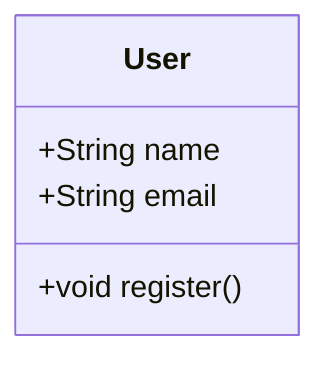
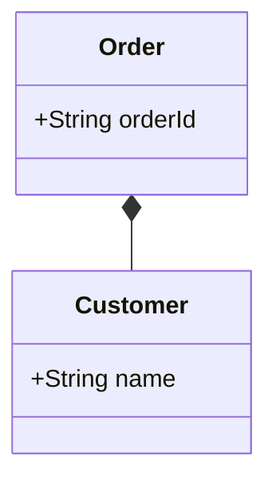
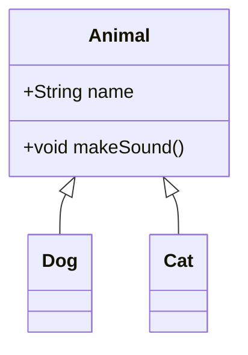

# Mermaid to PlantUML Converter

MermaidのドメインモデルクラスダイアグラムをPlantUMLに変換し、画像として出力するCLIツールです。

## 機能概要

- Mermaid形式のクラス図をPlantUML形式に変換
- PlantUMLを使用して画像（PNG/SVG/PDF）を生成
- CLIツールとして簡単に利用可能

## 前提条件

- Go 1.16以上
- PlantUML（以下のいずれかの方法でインストール）
  - Java + PlantUMLのjarファイル
  - Docker環境 + PlantUMLコンテナ

## インストール

```bash
go install github.com/yourusername/mermaid2plantuml@latest
```

## 使用方法

### 基本的な使用方法

```bash
mmd2img input.mmd
```

これにより、以下のファイルが生成されます：
- `input.puml` - 変換後のPlantUMLファイル
- `input.png` - 生成された画像ファイル

### オプション

```bash
# 出力フォーマットを指定（png/svg/pdf）
mmd2img -format svg input.mmd

# 出力ファイル名を指定
mmd2img -o output.png input.mmd
```

### コマンドラインオプション

| オプション | 説明 | デフォルト値 |
|------------|------|--------------|
| `-format` | 出力フォーマット（png/svg/pdf） | png |
| `-o` | 出力ファイルパス | 入力ファイル名をベースに生成 |

## サポートされている構文

### クラス定義



### クラス間の関連



### 継承関係



## 制限事項

- 現在サポートしているのはクラス図（`classDiagram`）のみ
- 以下の機能は未対応：
  - ER図（`erDiagram`）
  - シーケンス図（`sequenceDiagram`）
  - その他のMermaid図
- 関連の方向は左から右への記述のみサポート

## エラーメッセージ

| エラーメッセージ | 原因 | 対処方法 |
|------------------|------|-----------|
| 入力ファイルは.mmd拡張子である必要があります | 入力ファイルの拡張子が.mmdではない | ファイル名を.mmdに変更 |
| PlantUMLが利用できません | PlantUMLコマンドが見つからない | PlantUMLをインストール |
| 不正なクラスメンバー定義 | クラス内のメンバー定義が不正 | 構文を確認して修正 |

## 開発者向け情報

### プロジェクト構造

```
mermaid2plantuml/
├── main.go           # エントリーポイント
├── parser/          # Mermaid→PlantUML変換
│   ├── mermaid_parser.go
│   └── mermaid_parser_test.go
├── plantuml/        # PlantUML実行
│   ├── exec_plantuml.go
│   └── exec_plantuml_test.go
└── README.md
```

### テストの実行

```bash
go test ./...
```

### デバッグモード

デバッグ情報を出力する場合は、`parser.NewMermaidParser()`の`debug`フラグを`true`に設定します。

## ライセンス

MIT License

## 貢献

1. Fork the repository
2. Create your feature branch
3. Commit your changes
4. Push to the branch
5. Create a new Pull Request 